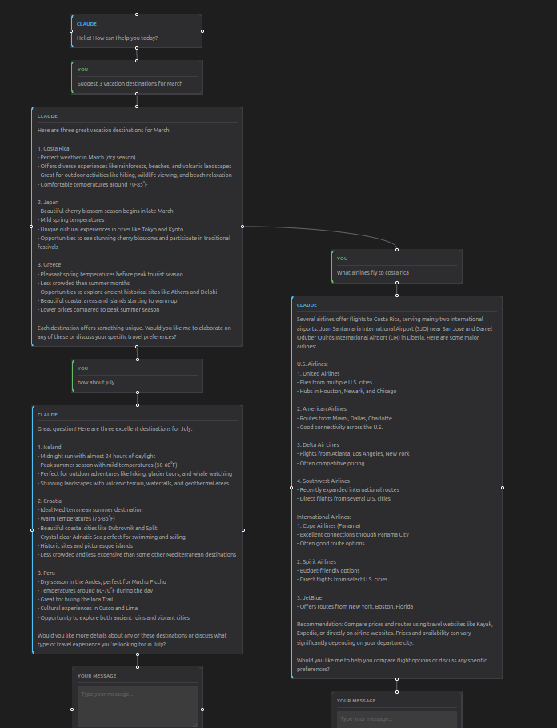

# LLM-DAG-UI

A UI wrapper for Claude which displays the conversation as a directed acyclic graph, allowing the user to "branch off" from conversation nodes.

**Try it out:** [llm-dag-ui.vercel.app](https://llm-dag-ui.vercel.app/)



## Features

- **Branching Conversations** — Drag from any message node to create a new conversation branch
- **Visual Graph Interface** — See your entire conversation tree at a glance using React Flow
- **Bring Your Own Key** — Users provide their own Anthropic API key (stored locally in browser)
- **Conversation History** — Each branch maintains full context back to the root
- **Cascade Deletion** — Deleting a node removes all of its descendants

## Architecture

```
┌─────────────┐     ┌─────────────┐     ┌─────────────────┐
│   Browser    │────▶│ Proxy Server│────▶│  Anthropic API  │
│  (React)     │◀────│  (Express)  │◀────│                 │
└─────────────┘     └─────────────┘     └─────────────────┘
```

- **Frontend**: React app with @xyflow/react for the node-based graph UI
- **Backend**: Express proxy server that forwards requests to Anthropic's API

The proxy server exists to:
1. Control which Claude model is used (server-side configuration)
2. Keep the architecture simple for self-hosting

## Getting Started

### Prerequisites

- Node.js 18+
- An Anthropic API key ([get one here](https://console.anthropic.com/settings/keys))

### Installation

```bash
# Clone the repository
git clone https://github.com/dgrims3/LLM-DAG-UI.git
cd LLM-DAG-UI

# Install dependencies
npm install

# Copy environment file
cp .env.example .env
```

### Development

Start both the frontend and proxy server with a single command:

```bash
npm run dev
```

This uses `concurrently` to run the Vite dev server (http://localhost:5173) and the Express proxy (http://localhost:3001) together.

Open http://localhost:5173 and enter your Anthropic API key to start chatting.

You can also run them independently:

```bash
npm run dev:frontend   # Vite dev server only
npm run proxy          # Express proxy only
```

### Production Build

```bash
npm run build
npm run preview
```

## Environment Variables

| Variable | Description | Default |
|---|---|---|
| `MODEL_NAME` | Claude model to use | `claude-3-5-haiku-20241022` |
| `CORS_ORIGIN` | Allowed frontend origin | `http://localhost:5173` |
| `PORT` | Proxy server port | `3001` |
| `VITE_API_URL` | Backend URL (frontend) | `http://localhost:3001` |

## Scripts

| Command | Description |
|---|---|
| `npm run dev` | Start frontend + proxy concurrently |
| `npm run dev:frontend` | Start Vite dev server only |
| `npm run proxy` | Start Express proxy only |
| `npm run build` | Production build |
| `npm run lint` | Run ESLint |
| `npm run preview` | Preview production build |

## Deployment

### Vercel (recommended)

The app deploys as a single Vercel project — the frontend is static and the proxy runs as a serverless function (`api/messages.js`).

1. Push to GitHub and import the repo on [vercel.com](https://vercel.com)
2. Set the `MODEL_NAME` environment variable (e.g. `claude-3-5-haiku-20241022`)
3. Deploy — no other configuration needed

### Self-hosted

1. Deploy `server.js` and `package.json` to any Node.js host
2. Build the frontend (`npm run build`) and serve the `dist` folder
3. Set `VITE_API_URL` to your backend URL and `CORS_ORIGIN` to your frontend URL

## Security & Privacy

- **Your API key never leaves your browser** — it is stored in `localStorage` and sent directly with each request. The server never logs or stores it.
- CORS is restricted to configured origins
- Users should only enter their API key on trusted deployments

## Tech Stack

- React 19
- Vite 7
- @xyflow/react (React Flow)
- Express 5
